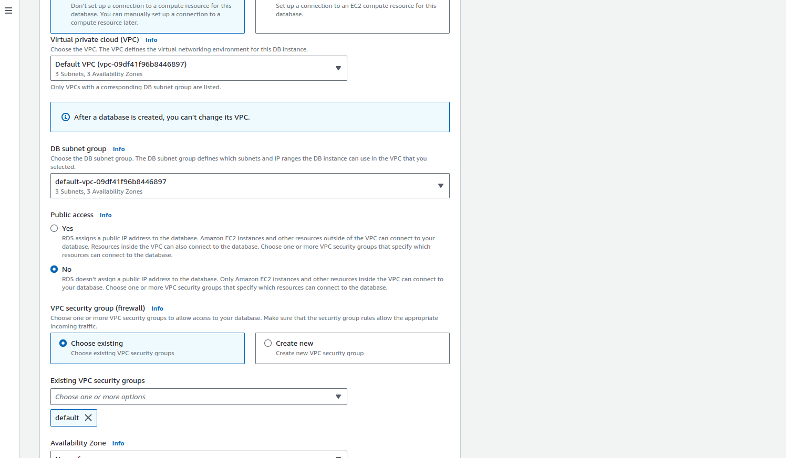
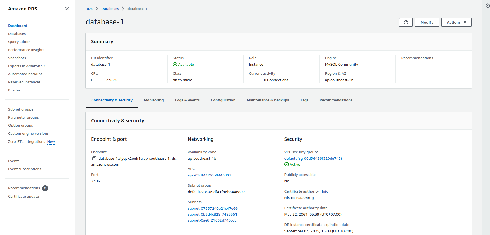

AWS RDS (Amazon Relational Database Service) is a managed relational database service provided by Amazon Web Services (AWS). It simplifies the process of setting up, operating, and scaling a relational database in the cloud. RDS supports multiple database engines, including MySQL, PostgreSQL, MariaDB, Oracle, SQL Server, and Amazon Aurora, allowing users to choose the database that best suits their needs.

## Use Cases for AWS RDS
- Web Applications: Use RDS as the backend for web applications, ensuring scalability and high availability.
- Data Warehousing: Use RDS to manage large datasets for business analytics.
- Enterprise Applications: Deploy RDS to support enterprise applications that require a reliable relational database.
- Development and Testing: Quickly set up databases for development and testing environments without the overhead of managing infrastructure.

## Create RDS Instance 
*Note:* Need to config **Public access** as *No* to set only EC2 instance can connect to it. 


```
# Test connection from EC2 Instance.
root@ip-172-31-20-115:~# mysql -hdatabase-1.clyqak2oeh1u.ap-southeast-1.rds.amazonaws.com -uadmin -p
Enter password: 
Welcome to the MySQL monitor.  Commands end with ; or \g.
Your MySQL connection id is 34
Server version: 8.0.35 Source distribution

Copyright (c) 2000, 2024, Oracle and/or its affiliates.

Oracle is a registered trademark of Oracle Corporation and/or its
affiliates. Other names may be trademarks of their respective
owners.

Type 'help;' or '\h' for help. Type '\c' to clear the current input statement.

mysql> show databases;
+--------------------+
| Database           |
+--------------------+
| information_schema |
| mysql              |
| performance_schema |
| sys                |
+--------------------+
4 rows in set (0.01 sec)

mysql> create database fcj;
Query OK, 1 row affected (0.01 sec)
```