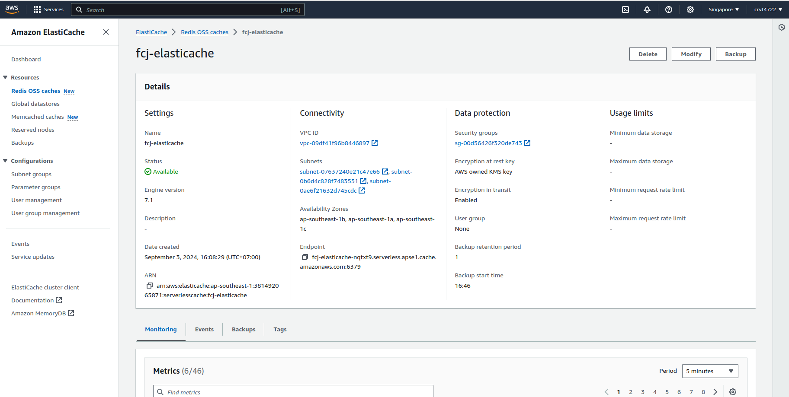

Amazon ElastiCache is a fully managed, in-memory caching service provided by AWS that supports two popular open-source in-memory data stores: Redis and Memcached. ElastiCache is designed to improve the performance of applications by allowing you to retrieve data from fast, managed, in-memory caches instead of relying entirely on slower disk-based databases.

## Use cases

- **Session Caching**: Storing session data for web applications.
- **Database Query Caching**: Caching the results of database queries to reduce load on your database and improve response times.
- **Message Queues**: Using Redis pub/sub features for real-time messaging.
- **Leaderboards and Counting**: Managing leaderboards in gaming or tracking real-time counts.
- **Machine Learning**: Caching model inferences or intermediate results for faster access.

## Create elasticache 
