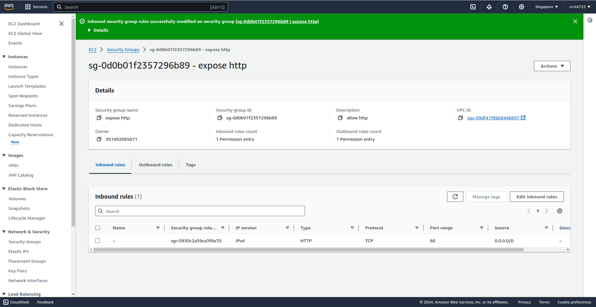
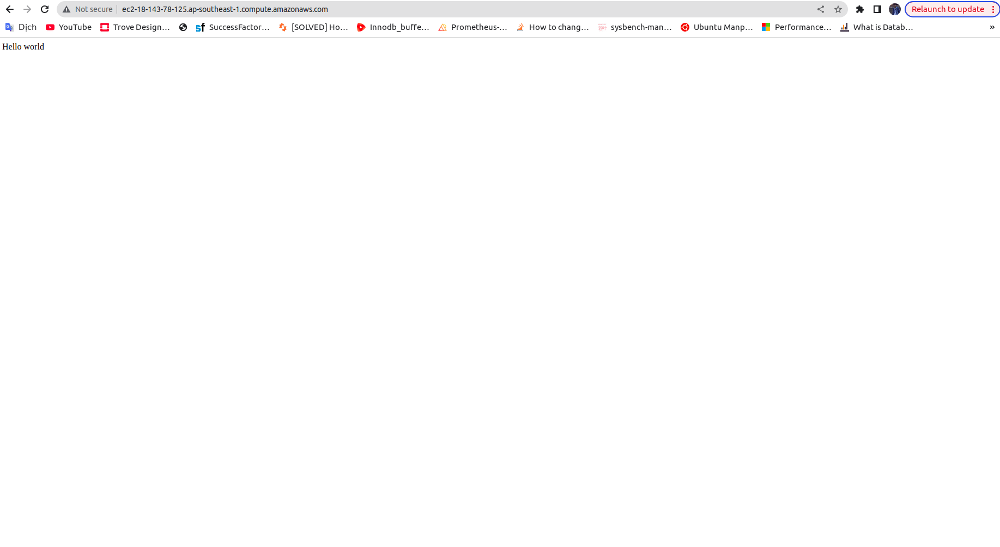

Amazon Elastic Compute Cloud (Amazon EC2) is a web service provided by Amazon Web Services (AWS) that offers scalable compute capacity in the cloud. It allows you to launch and manage virtual servers, known as instances, which you can use to run applications, host websites, manage databases, or perform any computing task you would typically run on physical servers.

## Common Use Cases
- **Web Hosting:** Host dynamic websites and web applications.
- **Data Processing:** Perform data processing tasks such as big data analytics, machine learning, and batch processing.
- **Dev/Test Environments:** Quickly create and tear down development and testing environments.
- **Disaster Recovery:** Implement disaster recovery solutions by running secondary copies of your production environment.
- **Scalable Applications:** Run applications that require high availability, scalability, and flexibility.

## Create Simple Application 
First, I will show the source manual coude of the simple application to run web server use RDS and Elasticache to store data. 
```
from flask import Flask, jsonify, request
import mysql.connector
import redis
import json
import os

app = Flask(__name__)

# Fetch MySQL configuration from environment variables
db_config = {
    'host': os.getenv('MYSQL_HOST'),
    'user': os.getenv('MYSQL_USER'),
    'password': os.getenv('MYSQL_PASSWORD'),
    'database': os.getenv('MYSQL_DATABASE')
}

# Set up Redis (ElastiCache) connection using environment variables
redis_cache = redis.Redis(
    host=os.getenv('REDIS_HOST'), 
    port=int(os.getenv('REDIS_PORT', 6379)), 
    decode_responses=True
)

# Function to connect to MySQL database
def get_db_connection():
    return mysql.connector.connect(**db_config)

# API to retrieve data by ID
@app.route('/data/<int:data_id>', methods=['GET'])
def get_data(data_id):
    # Check if the data exists in the Redis cache
    cached_data = redis_cache.get(f'data:{data_id}')
    if cached_data:
        # If found in cache, return the cached data
        return jsonify({'source': 'cache', 'data': json.loads(cached_data)})
    
    # If not in cache, retrieve data from MySQL
    conn = get_db_connection()
    cursor = conn.cursor(dictionary=True)
    cursor.execute("SELECT * FROM your_table WHERE id = %s", (data_id,))
    result = cursor.fetchone()
    
    if result:
        # If found in MySQL, save the result to the cache for future requests
        redis_cache.set(f'data:{data_id}', json.dumps(result))
        return jsonify({'source': 'mysql', 'data': result})
    else:
        # Return 404 if the data is not found
        return jsonify({'message': 'Data not found'}), 404

# API to create new data
@app.route('/data', methods=['POST'])
def create_data():
    # Retrieve the data from the request body
    new_data = request.json
    conn = get_db_connection()
    cursor = conn.cursor()
    
    # Insert new data into MySQL
    cursor.execute("INSERT INTO your_table (name, value) VALUES (%s, %s)", 
                   (new_data['name'], new_data['value']))
    conn.commit()
    
    # Clear all cache to make sure the new data is reflected in future requests
    redis_cache.flushall()
    
    return jsonify({'message': 'Data created successfully'}), 201

# API to update existing data by ID
@app.route('/data/<int:data_id>', methods=['PUT'])
def update_data(data_id):
    # Retrieve the updated data from the request body
    update_data = request.json
    conn = get_db_connection()
    cursor = conn.cursor()
    
    # Update the existing record in MySQL
    cursor.execute("UPDATE your_table SET name = %s, value = %s WHERE id = %s", 
                   (update_data['name'], update_data['value'], data_id))
    conn.commit()
    
    # Delete the cache for this specific data ID to ensure future requests get the updated data
    redis_cache.delete(f'data:{data_id}')
    
    return jsonify({'message': 'Data updated successfully'})

# API to delete data by ID
@app.route('/data/<int:data_id>', methods=['DELETE'])
def delete_data(data_id):
    conn = get_db_connection()
    cursor = conn.cursor()
    
    # Delete the record from MySQL
    cursor.execute("DELETE FROM your_table WHERE id = %s", (data_id,))
    conn.commit()
    
    # Delete the corresponding cache entry to prevent serving stale data
    redis_cache.delete(f'data:{data_id}')
    
    return jsonify({'message': 'Data deleted successfully'})

# Run the Flask app
if __name__ == '__main__':
    app.run(debug=True)
```

## Launch EC2 Instance of the Work Shop
Implemetation steps: 
- Install Python and neccessary libary 
    ```
    sudo apt update
    sudo apt install python3-flask
    sudo apt install python3-redis
    sudo apt install python3-pymysql
    ```
- Config connection enviroment with RDS and Elasticache
    ```
    SET MYSQL_HOST=public_rds_domain
    SET MYSQL_USER=admin
    ...
    SET REDIS_HOST=public_elasticache_domain
    ```
- Run Application
    ```python3 app.py```
- Create security group to allow HTTP request
    
- Verify
    

- Create **Launch Template** to build Auto Scaling Group.  


