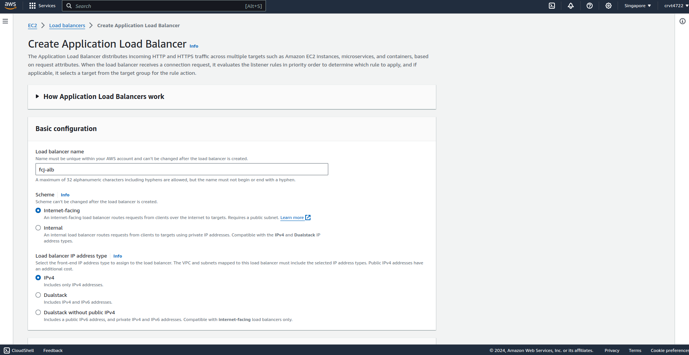
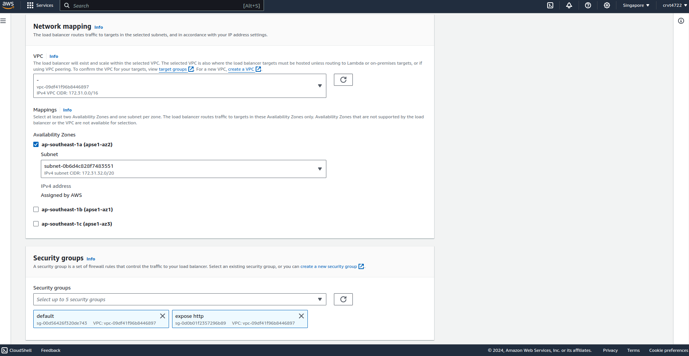
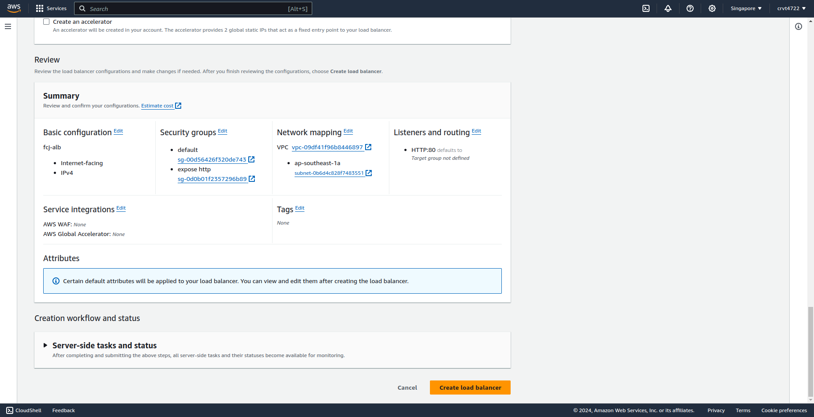
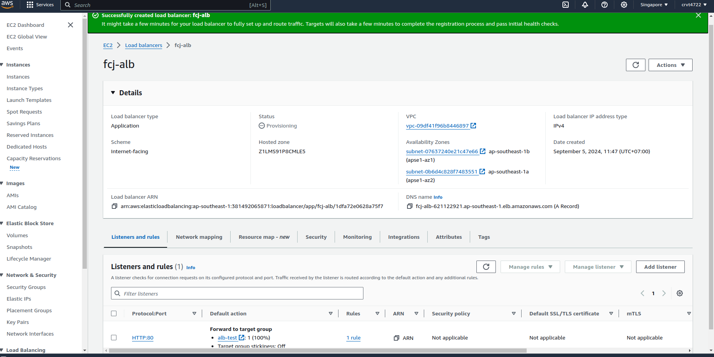

An AWS Elastic Load Balancer (ELB) is a fully managed load balancing service that automatically distributes incoming application traffic across multiple targets (such as EC2 instances, containers, IP addresses, and Lambda functions) in one or more Availability Zones (AZs). ELB helps ensure high availability, fault tolerance, and improved performance for your applications by evenly distributing traffic to prevent any single resource from becoming overloaded.

### Types of AWS Elastic Load Balancers:

1.  **Application Load Balancer (ALB):**
    
    -   Best suited for HTTP and HTTPS traffic.
    -   Works at the application layer (Layer 7 of the OSI model), allowing you to route traffic based on advanced, content-based rules such as hostnames, URLs, and headers.
    -   Supports modern protocols like WebSockets, HTTP/2, and gRPC.
    -   Ideal for microservices and container-based applications, as it integrates well with Amazon ECS, Kubernetes, and supports dynamic port mapping.
    -   ALB can route traffic to multiple services based on URL paths (e.g., `/api` routes to one target group, `/app` routes to another).
2.  **Network Load Balancer (NLB):**
    
    -   Optimized for TCP, UDP, and TLS traffic.
    -   Operates at the transport layer (Layer 4 of the OSI model) and is capable of handling millions of requests per second with extremely low latency.
    -   Suitable for high-performance workloads such as gaming, real-time video streaming, or IoT, where speed and performance are critical.
    -   NLB can preserve the source IP address, which is important for certain compliance or security applications.
    -   It’s capable of routing traffic based on static IP addresses or Elastic IPs.
3.  **Classic Load Balancer (CLB):**
    
    -   The original AWS load balancer, which supports both Layer 4 (TCP) and Layer 7 (HTTP/HTTPS) traffic.
    -   Ideal for simple load balancing of applications.
    -   Considered legacy and is generally used for older AWS architectures. AWS recommends using ALB or NLB for new applications.
4.  **Gateway Load Balancer (GWLB):**
    
    -   Designed to handle third-party virtual appliances (like firewalls, IPS/IDS, or deep packet inspection systems).
    -   Operates at Layer 3, functioning as a transparent gateway for packet traffic and routing it to the appropriate virtual appliance.
    -   Supports scaling and fault tolerance for virtual appliances.

## Create Elastic Load Balancer
In this part, I will use Application Load Balancer to load balance traffic of web server with Auto Scaling Group.  

