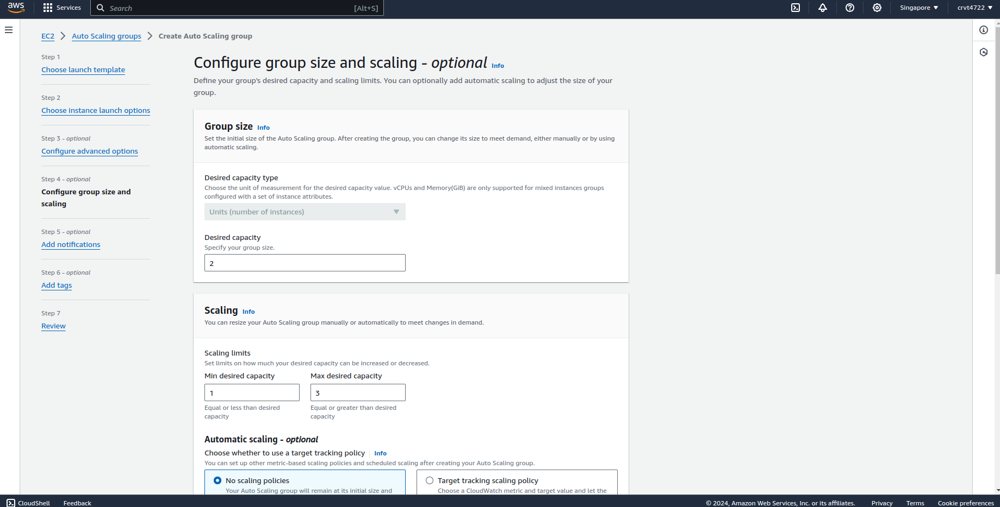

AWS Auto Scaling Groups (ASG) are a key feature of AWS Auto Scaling that helps you maintain high availability and ensure your application has the right amount of resources by automatically adjusting the number of Amazon EC2 instances based on conditions you define. 

## Use cases
- **High Availability:** ASG ensures that your application remains available by automatically replacing unhealthy instances or scaling to meet demand.
- **Elasticity and Cost Efficiency:**ASG automatically scales resources based on demand, allowing you to save costs by scaling down during low traffic periods and scaling up when demand increases.
- **Multi-AZ Support:** Auto Scaling Groups can span multiple Availability Zones (AZs), distributing instances across zones to improve fault tolerance.
- **Automated and Hands-Off Management:** By automating the scaling and health management of instances, ASG reduces the manual effort needed to manage an application's compute resources.

## Create Auto Scaling Group
In order to create ASG, we need to create Launch Template first. Launch Template is created from the AMI Image we created from EC2 web server instance before. 

As you can see, I have 3 EC2 identical servers belong to the Auto Scaling Group we created.