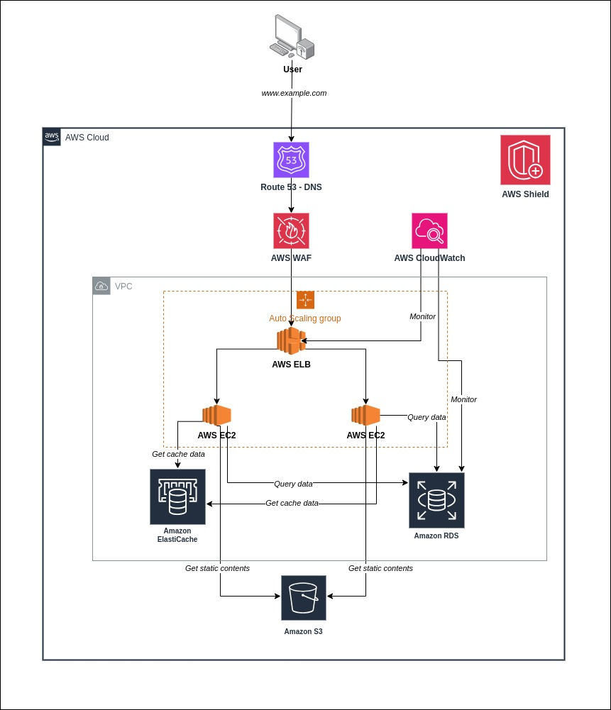

## FCJ Workshop 001: Deploy a highly available, high-performance, and secure website for businesses using AWS services.
 

### 1. Overview

In the modern business world, continuous competition and the need to respond quickly and efficiently to users are key factors in the success of any enterprise. Deploying a website with high availability, robust performance, and solid security not only enhances a company's reputation but also creates a superior user experience, driving sustainable growth. To achieve this, Amazon Web Services (AWS) has become an indispensable tool, helping businesses not only build but also optimize their web systems. In today's workshop, we will explore the essential steps and AWS services that can help you deploy a website that not only meets but exceeds customer expectations, ensuring business continuity and enhancing competitiveness in the market.

### 2. Architecture
To achieve that goal, the system components related to the website will be deployed according to the architectural model below.

In which: 
- **EC2**: run the web server
- **AWS Elastic Load Balancing (ELB)**: responsible for load balancing to the servers.
- **AWS Application Auto Scaling**: automatically scales the number of servers up or down during high load or otherwise, to maximize user experience.
- **AWS S3**: store the static files of the website.
- **AWS RDS**: primary database of server, store data of the website.
- **AWS Elasticache**:  store server cache data, accelerating query speed and system performance.
- **AWS Cloudwatch**: monitor the entire system and triggers alerts when incidents occur.
- **AWS Security Groups và Network ACLs**: manage access to the servers.
- **AWS WAF**: protect the web application from common security threats, such as SQL injection and cross-site scripting (XSS).
- **AWS Route 53**: DNS 